.. include:: common.rst

Design 设计
====================

本章讨论 |FyTok| 的概要设计，阐述基本设计原则，基础架构，数据模型和功能模块。

.. note:: 本文中以Python作为默认开发语言，但设计思想不以此为限，主要功能都应可采用其他语言实现。

Principles of Design 设计原则
--------------------------------

明确“设计原则”是为了保证程序实现的整体一致性，消除歧义。

Data Model 数据模型
^^^^^^^^^^^^^^^^^^^^^^^^^^^^^

数据模型是 |FyTok| 的骨干
    用来描述 |Tokamak| 各个物理系统时间、空间和物理量的状态信息，表现物理量之间的逻辑和隶属关系。

数据模型不描述约束关系和动态演化
    数据量之间存在由物理规律（演化方程、边界条件）决定的内在约束，数据模型检查内在约束关系是否成立，也不负责由这些约束
    关系导出新的数据。

数据模型不限定于某一种物理载体
    数据模型是实例的存储、传递依赖于后端实现。数据模型只对访问路径与数据的对应关系给出标准化的约定。

数据组织应采用层次化树状结构  
    |Tokamak| 状态描述涉及大量参数，层次化树状结构能够更好表达数据组织关系和实际语义，遵循 Document Object Model (DOM)
    设计模式。这一原则延续了ITER “物理数据模型”的设计思想。

数据应具有明确的语义
    明确定义的语义对于模块间数据交互至关重要。这里“语义”，包含但不限于，数据类型（如，int，float，string，array等），
    物理含义，物理量单位，对于时间序列还应明确时间轴。数据的“语义”定义依赖于IMAS的Data Dictionary（DD）的定义，
    可根据数据在DOM中的路径（path）在 DD 中找到对应语义。

数据应保持全局的一致性
    数据全局一致性是指，在全局任何一个地方经由同一path访问数据树所获得的结果应是确定一致的。由于 |FyTok| 模块与主程序之间
    并不一定共享地址空间，数据在不同进程和存储介质间传递、转换过程中保持一致性是必须要始终贯彻原则。采用统一数据访问接口 
    Unified Data Access, UDA，是解决这一问题的可行方法。

消除数据歧义：多个路径对应同一数据
    为了保证对于单一IDS表述的完整性，有些全局性数据会在不同的IDS中重复出现，例如，在 equilibrium 和 core_profiles 等多个
    IDS出现的 vacuum_magnetic_field。DD 描述的是数据访问的语义，并未限制数据存储方式。在访问路径path与实际数据的映射之间，
    需要保证数据的唯一性。

数据对象应具有“不可变（immutable）”语义
    数据对象带有“immutable”语义可以大幅度降低复杂度。数据节点之间存在复杂的网状依赖关系，单一数据也会出现分布式存储情况。
    保持“immutable”属性可以避免破坏数据语义的全局一致性。

维护物理量间的自洽关系
    IDS中定义的物理量对于描述系统状态来说是冗余的，一些物理量之间存在明确的导出关系。例如，环向磁通 :math:`\Phi_{tor}`，
    角向磁通 :math:`\psi` 与安全因子 :math:`q` 三者间由明确定义的数学关系。同时存储三个物理量，不能明确保证三者间的依赖关系。
    应考虑存储其中两个量，在实际访问第三个量时实时计算出第三个量。配合immutable属性和数据缓冲，可以保证数据内在逻辑的自洽。

Modules 模块
^^^^^^^^^^^^^^^^^^^^^^

模块描述数据节点之间的约束关系
    不同的数据状态在数据树中对应不同的数据节点，模块负责节点之间的数据的转化关系。以数据为节点，模块为边构成数据流的
    有向无环图（DAG）

物理模块定义数据量之间的物理约束关系
    物理量之间存在由物理规律决定的内在约束，也就是各类方程、函数。“模块”负责这些约束关系的具体实现。也就是数值计算对应
    的求解边值问题和初值问题。

模块划分应与IMAS数据模型保持一致
    IMAS物理数据模型对于 |Tokamak| 各个子系统的描述十分详尽。采用与其一致的模块划分可以保证数据交互接口的兼容性。

模块应是无状态的，不可变的 immutable，可复制的
    目的是为了降低模块部署、调度过程中的复杂度，有利于将DAG在分布式并行环境的调度部署。

模块功能保持明确单一，保证模块的可替代性
    模块的功能应保持明确且单一，仅实现一个操作，求解一组方程。不应进行超出约定之外的数据操作。

Infrastructure 基础架构
------------------------

    |FyTok| 基础环境架构

|FyTok| 的基础架构是指运行 |FyTok| 的计算环境，主要由四部分构成：

    * **UI/UX 交互界面** : 用户与 |FyTok| 交互的环境。 需要在其中实现“执行图”编写、调试、数据可视化等功能。计划采用科学交互
      计算环境Jupyter作为主要环境。

    * **数据源** : 是数据的实际存储载体。可以是本地数据文件、远程数据库或其他具有CRUD(Create, Read, Update, Delete)功能数据源。
      这些数据源通常不具有标准的IMAS数据标准语义，需要通过UDA进行转换。

    * **外部模块** ：|FyTok| 中的物理模块可通过插件的方式替换。每个模块对应一个外部模拟程序，同一个功能会有多个不同外部程序
      实现。这些模块需要通过独立的版本系统管理，从而保障整体建模结果的可追溯性和可重复性。

    * **高性能计算环境** ：物理建模需要庞大的计算资源支持，离不开分布式的高性能计算环境。当需要并行计算时 |FyTok| 生成描述
      工作流的DAG，然后通过调度引擎完成计算。

关于 |FyTok| 运行环境架构的细节，在《 |FyDev| 设计文档》中详细阐述。

Data 数据
-----------------------

Data Representation 数据表述
^^^^^^^^^^^^^^^^^^^^^^^^^^^^^^

在 |FyTok| 中数据类型方式划分为四种基本形式：

    * **Scalar 标量** : 对应于整型（int），浮点（float）和 字符串（string）等元数据类型；

    * **nd-array 多维数组**: 由单一元数据类型（scalar）构成的紧密规则排列的阵列，在不同场景下也被称为tensor、matrix 
      或者array。实现上采用numpy.ndarray表示。 

    * **Sequence 序列** : 一组数据的有序排列，数据类型可以不一致，在不同场合下也被称为 list，tuple，array（不同于前面
      的单一类型构成的数组）

    * **Mapping 映射** : 一组 key-value 组成的集合，在不同场合下也被称为 dict，object，structure等

目前，结构化数据表述方式主要有JSON和XML两种风格。|FyTok| 的表述方式在JSON格式的基础上，针对数值计算的需求增加了
ndarray类型。

|FyTok| 采用层次化树状数据结构，其中根节点为Mapping类型，中间节点为Sequence或者Mapping类型，叶节点为Scalar或者
nd-array类型。

与XML文档树结构转换时，XML文档树中具有相同标签Tag的兄弟节点汇总为一个Sequence节点，默认按照XML文档中的先后顺序排列。

在Mapping类型中，key-value对的顺序，依照构建时插入的顺序排列（这里遵循Python OrderedDict定义）。

Path 数据访问路径
^^^^^^^^^^^^^^^^^^^^

通过Path在文档中定位节点位置，支持XPath和JSONPath两种语法。

例如：``/wall/description_2d[0]/limiter/unit[1]/outline/r`` 或者 ``equilibrium.time_slice[1:10:2].profiles_2d.psi``

    
+--------+----------------------+-----------------------------------+
| XPath  | JSONPath             | 描述                              |
+========+======================+===================================+
| ``/``  | ``$``                | 根节点                            |
+--------+----------------------+-----------------------------------+
| ``.``  | ``@``                | 当前值                            |
+--------+----------------------+-----------------------------------+
| ``/``  | ``.`` or ``[]``      | 子节点算符                        |
+--------+----------------------+-----------------------------------+
| ``//`` | ``..``               | 上一层                            |
+--------+----------------------+-----------------------------------+
| ``*``  | ``*``                | 通配符                            |
+--------+----------------------+-----------------------------------+
| ``[]`` | ``[]``               | 下标算符                          |
+--------+----------------------+-----------------------------------+
| ``|``  | ``[,]``              | 联合算符 (对于两个以上下标算符）  |
+--------+----------------------+-----------------------------------+
| n/a    | ``[start:end:step]`` | slice 算符（仅对Sequence节点有效）|
+--------+----------------------+-----------------------------------+
| ``[]`` | ``?()``              | filter expression                 |
+--------+----------------------+-----------------------------------+

语法：属性访问 
    >>> equilibrium.time_slice[1:10:2].profiles_2d.psi[:]=0.0

语法：遍历
    >>> for eq in equilibrium.time_slice:
            print(eq.profiles_2d.psi)

Unified Data Access  统一数据访问接口 
^^^^^^^^^^^^^^^^^^^^^^^^^^^^^^^^^^^^^^^^^

|Tokamak| 实验数据组织的特点是围绕着放电（shot）展开，每个shot单独可以成为一个树。在 |FyTok| 中每一个shot抽象表述为一个“文档（Document）”，具有唯一的编号ID。
数据库则被视为文档的集合（collection）。这种数据组织形式可以归类为No-SQL数据库形式，所谓的Document Database。例如，传统 MDSPlus 的数据库，商业数据库 MongnoDB，
Amazon Cosmos DB，Microsoft  Document DB 等满足这一抽象。

数据源的通常指实验数据库，其访问协议是多样的，为了简化应用 |FyTok| 采用了 Unified Data Access  统一数据访问接口形式。

数据源采用 Uniform Resource Identifier (URI) 表述，遵循国际标准 RFC 3986， 其正则表达式为

    ``r"^((?P<schema>[^:/?#]+):)?(//(?P<authority>[^/?#]*))?(?P<path>[^?#]*)(\?(?P<query>[^#]*))?(#(?P<fragment>.*))?")``

例如，

>>> entry=open_entry("east+mdsplus://mdsplus.ipp.ac.cn/?tree_name=efit_east#shot=55555, time_slice=100")
>>> entry=open_entry("east+mdsplus:///home/salmon/public_data/~t/?tree_name=efit_east#shot=55555, time_slice=100")
>>> entry=open_entry("/home/salmon/public_data/efit_east_00055555.h5#time_slice=100")

其中
    * schema 表示数据源的访问协议和采取数据映射（见 `Mapping 数据映射`_），例如 "east+mdsplus"，意为采用EAST数据映射，mdsplus访问协议。
    * authority 表示数据源访问权限，例如，mdsplus.ipp.ac.cn 。
    * path 指Collection在数据库中的路径，当schema和authority为空的时候，path可对应为本地文件，数据格式由文件的扩展名确定。
    * query 和 fragment，解析为一系列key-value值，用于在Document树中定位节点，例如，``time_slice=100``，意为选择编号为100的时间片

Mapping 数据映射
^^^^^^^^^^^^^^^^^^

**物理数据模型** 根据数据语义内在的依赖关系，将其组织为层次化的树状结构，并给予统一的访问标识URI，形成统一的命名空间。 原始数据是分散
存储在不同的数据源中的，需要经过 **Mapping 数据映射** 的过程将其组织在统一命名空间下。

根据数据的存储特性，可以分为三类

    * static data 静态数据，
        通常指装置构型的参数，如 limiter 的形状，PF 线圈的位置等。对于确定的装置，这些数据始终保持不变，具有只读属性。

    * dynamic data 动态数据
        实验过程中采集的控制和诊断信号，一般源自实验数据库，依赖于具体的实验炮号（shot number），具有只读属性。
        
    * generated data 生成数据，
        通过模拟、建模、分析的过程生成的数据，可以进行读写操作。

    数据映射

数据映射过程如上图所示，其中映射文件以XML文件的格式定义。文件结构与IMAS物理数据一致，节点的值对应映射的结果。对于静态数据直接将数据存储在映射文件中，
动态数据返回对应的数据库访问命令。

例如，EAST　静态数据的映射文件　``ids=wall``

.. code-block:: xml 
    
    <?xml version="1.0" encoding="UTF-8"?>
    <wall>
    <ids_properties>
        
        <comment>
        </comment>
        <provider>Guo, Yong</provider>
        <creation_date>2020-10-12</creation_date>

        <!--  CONSTANT -->
        <homogeneous_time dtype="int">2</homogeneous_time>
    </ids_properties>

    <description_2d>
        <type>
        <name>equilibrium</name>
        <index dtype='int'>1</index>
        </type>

        <limiter>
        <type>
            <name>limiter</name>
            <index dtype='int'>0</index>
        </type>
        <unit>
            <name>limiter</name>
            <closed dtype='int'>1</closed>
            <outline>
            <r dtype='float'>
                2.277, 2.273, 2.267, 1.940, 1.940, 1.802, 1.773, 1.751, 1.736, 1.714, 1.707, 1.696, 1.665, 
                1.656, 1.635, 1.612, 1.478, 1.459, 1.440, 1.436, 1.399, 1.379, 1.392, 1.430, 1.439, 1.442, 
                1.437, 1.363, 1.361, 1.361, 1.361, 1.363, 1.421, 1.423, 1.422, 1.418, 1.331, 1.367, 1.564, 
                1.597, 1.598, 1.624, 1.754, 1.765, 1.814, 1.824, 1.825, 1.841, 1.971, 1.971, 2.267, 2.273, 
                2.277, 2.277, 2.306, 2.328, 2.343, 2.350, 2.350, 2.350, 2.343, 2.328, 2.306, 2.277  </r>
            <z dtype='float'>
                0.485,    0.485,   0.493,   0.809,   0.809,   0.926,   0.956,   0.993,   1.033,   1.131,  1.162,   1.142,   
                1.117,   1.111,   1.096,   1.084,   1.025,   1.021,   1.024,   1.026,   1.039,   1.049,   1.014,   0.909,   
                0.873,   0.835,   0.799,   0.456,   0.454,   0.000,  -0.454,  -0.456,  -0.725,  -0.748,  -0.749,  -0.770, 
                -1.011,  -0.977,  -0.938,  -0.941,  -0.941,  -0.961,  -1.139,  -1.170,  -0.959,  -0.934,  -0.932,  -0.910,  
                -0.783,  -0.783,  -0.493,  -0.485,  -0.485,  -0.309,  -0.244,  -0.176,  -0.106,  -0.036,   0.000,   0.036,  
                0.106,   0.176,   0.244,   0.309    </z>
            
            </outline>
        </unit>
        </limiter>
        <vessel>
            <name>EAST</name>
            <identify>EAST</identify>
            <annular>
            <outline_inner>
                <closed dtype='int'>1</closed>
                <r dtype='float'>
                2.7286000,  2.7069000,  2.6640000,  2.6007000,  2.5178000,  2.4170000,  2.2997000,  2.1681000,  2.0244000,  1.8708000,  
                1.7090000,  1.5435000,  1.3902000,  1.2814000,  1.2402000,  1.2370000,  1.2370000,  1.2370000,  1.2370000,  1.2370000,  
                1.2370000,  1.2370000,  1.2370000,  1.2370000,  1.2370000,  1.2402000,  1.2814000,  1.3902000,  1.5435000,  1.7090000,  
                1.8708000,  2.0244000,  2.1681000,  2.2997000,  2.4170000,  2.5178000,  2.6007000,  2.6640000,  2.7069000,  2.7286000 
                </r>
                <z dtype='float'> 
                0.0832890,   0.2484600,   0.4094200,   0.5634700,   0.7080000,   0.8405800,   0.9589200,   1.0610000,   1.1452000,   1.2095000,   
                1.2454000,   1.2439000,   1.1907000,   1.0750000,   0.9185700,   0.7517300,   0.5846800,   0.4176300,   0.2505800,   0.0835260, 
                -0.0835260,  -0.2505800,  -0.4176300,  -0.5846800,  -0.7517300,  -0.9185700,  -1.0750000,  -1.1907000,  -1.2439000,  -1.2454000,  
                -1.2095000,  -1.1452000,  -1.0610000,  -0.9589200,  -0.8405800,  -0.7080000,  -0.5634700,  -0.4094200,  -0.2484600,  -0.0832890
                </z>
            </outline_inner>
            <outline_outer>
                <closed dtype='int'>1</closed>
            
                <r dtype='float'>
                    2.8440000,  2.8204000,  2.7737000,  2.7046000,  2.6143000,  2.5045000,  2.3771000,  2.2343000,  2.0786000,  1.9127000,  
                    1.7389000,  1.5637000,  1.3995000,  1.2722000,  1.2108000,  1.1990000,  1.1990000,  1.1990000,  1.1990000,  1.1990000,  
                    1.1990000,  1.1990000,  1.1990000,  1.1990000,  1.1990000,  1.2108000,  1.2722000,  1.3995000,  1.5637000,  1.7389000,  
                    1.9127000,  2.0786000,  2.2343000,  2.3771000,  2.5045000,  2.6143000,  2.7046000,  2.7737000,  2.8204000,  2.8440000                 
                </r>
                <z dtype='float'>
                    0.0892160,   0.2660800,   0.4382800,   0.6028000,   0.7567100,   0.8973500,   1.0223000,   1.1292000,   1.2164000,   1.2820000,   
                    1.3197000,   1.3165000,   1.2605000,   1.1444000,   0.9828800,   0.8053200,   0.6263600,   0.4474000,   0.2684400,   0.0894800,  
                    -0.0894800,  -0.2684400,  -0.4474000,  -0.6263600,  -0.8053200,  -0.9828800,  -1.1444000,  -1.2605000,  -1.3165000,  -1.3197000,  
                    -1.2820000,  -1.2164000,  -1.1292000,  -1.0223000,  -0.8973500,  -0.7567100,  -0.6028000,  -0.4382800,  -0.2660800,  -0.0892160                
                </z>
            </outline_outer>
            <!-- <centreline>
                <closed dtype='int'>1</closed>
                <r dtype='float'></r>
                <z dtype='float'></z>
            </centreline>
            <thickness dtype='float'></thickness>
            <resistivity dtype='float'></resistivity> -->
            </annular>
        </vessel>

    </description_2d>
    </wall>

EAST　动态映射文件　``ids=equilibrium``

.. code-block:: xml 

    <?xml version="1.0" encoding="UTF-8"?>
    <equilibrium xmlns:spdb="http://fusionyun.org/schema/">
        <ids_properties>
            <homogeneous_time dtype="int">0</homogeneous_time>
        </ids_properties>
        <time><spdb:data protocol="mdsplus">DATA(\TIME)</spdb:data></time>
        <vacuum_toroidal_field>
                <!--!!!! NOTE !!! east_efit://RBCENT and BCENTR should swap positions -->
                <r0><spdb:data protocol="mdsplus" >DATA(\BCENTR)[{time_slice}]</spdb:data></r0>                
                <b0><spdb:data protocol="mdsplus" >DATA(\RBCENT)[{time_slice}]</spdb:data></b0>
        </vacuum_toroidal_field>
        <time_slice id="*">
            <boundary>
                <type>1</type>
                <outline>
                    <r><spdb:data protocol="mdsplus">DATA(\BDRY)[0, 0: DATA(\NBDRY)[{time_slice}]-1, {time_slice}]</spdb:data></r>
                    <z><spdb:data protocol="mdsplus">DATA(\BDRY)[1, 0: DATA(\NBDRY)[{time_slice}]-1, {time_slice}]</spdb:data></z>
                </outline>
                <psi><spdb:data protocol="mdsplus">DATA(\SSIBRY)</spdb:data></psi>

                <geometric_axis>
                    <r><spdb:data protocol="mdsplus">DATA(\RSURF[{time_slice}])</spdb:data></r>
                    <z><spdb:data protocol="mdsplus">DATA(\ZSURF[{time_slice}])</spdb:data></z>
                </geometric_axis>

                <elongation><spdb:data protocol="mdsplus">DATA(\KAPPA[{time_slice}])</spdb:data></elongation>
                <triangularity_lower><spdb:data protocol="mdsplus">DATA(\TRIBOT[{time_slice}])</spdb:data></triangularity_lower>
                <triangularity_upper><spdb:data protocol="mdsplus">DATA(\TRITOP[{time_slice}])</spdb:data></triangularity_upper>

            </boundary>

            <coordinate_system>
                <grid_type>
                    <name>rectangular</name>
                    <index dtype='int'>0</index>
                    <description>Cylindrical R, Z ala eqdsk (R=dim1, Z=dim2). 
                        In this case the position arrays should not be filled since 
                        they are redundant with grid/dim1 and dim2.</description>
                </grid_type> 
                <grid>
                    <dim1><spdb:data protocol="mdsplus">SIZE(DATA(\PPRIME)[*, {time_slice}])</spdb:data></dim1>
                    <dim2><spdb:data protocol="mdsplus">DATA(\NBDRY)[{time_slice}]</spdb:data></dim2>
                </grid>
              
            </coordinate_system>                

            <global_quantities>
                <beta_pol><spdb:data protocol="mdsplus">DATA(\BETAP)[{time_slice}]</spdb:data></beta_pol>
                <beta_tor><spdb:data protocol="mdsplus">DATA(\BETAT)[{time_slice}]</spdb:data></beta_tor>
                <beta_normal><spdb:data protocol="mdsplus">DATA(\BETAN)[{time_slice}]</spdb:data></beta_normal>

                <ip><spdb:data protocol="mdsplus">DATA(\EFIT_MFILE:PLASMA)[{time_slice}]</spdb:data></ip>

                <li_3><spdb:data protocol="mdsplus">DATA(\LI)[{time_slice}]</spdb:data></li_3>

                <volume><spdb:data protocol="mdsplus">DATA(\VOLUME)[{time_slice}]</spdb:data></volume>

                <psi_axis><spdb:data protocol="mdsplus">DATA(\SSIMAG)[{time_slice}]</spdb:data></psi_axis>

                <psi_boundary><spdb:data protocol="mdsplus">DATA(\SSIBRY)[{time_slice}]</spdb:data></psi_boundary>

                <magnetic_axis>
                    <r><spdb:data protocol="mdsplus">DATA(\RMAXIS)[{time_slice}]</spdb:data></r>
                    <z><spdb:data protocol="mdsplus">DATA(\ZMAXIS)[{time_slice}]</spdb:data></z>
                    <b_field_tor><spdb:data protocol="mdsplus">DATA(\BCENTR)[{time_slice}]</spdb:data></b_field_tor>
                </magnetic_axis>

                <q_axis><spdb:data protocol="mdsplus">DATA(\Q0)[{time_slice}]</spdb:data></q_axis>
                <q_95><spdb:data protocol="mdsplus">DATA(\Q95)[{time_slice}]</spdb:data></q_95>
                <q_min>
                    <value><spdb:data protocol="mdsplus">DATA(\QL)[{time_slice}]</spdb:data></value>
                    <rho_tor_norm><spdb:data protocol="mdsplus">DATA(\AMINOR)[{time_slice}]</spdb:data></rho_tor_norm> <!-- need comment -->
                </q_min>

                <energy_mhd><spdb:data protocol="mdsplus">DATA(\WMHD)[{time_slice}]</spdb:data></energy_mhd>
            </global_quantities>

            <profiles_1d>
                <f><spdb:data protocol="mdsplus">DATA(\FPOL)[*, {time_slice}]</spdb:data></f>
                <dpressure_dpsi><spdb:data protocol="mdsplus">DATA(\PPRIME)[*, {time_slice}]</spdb:data></dpressure_dpsi>
                <f_df_dpsi><spdb:data protocol="mdsplus">DATA(\FFPRIM)[*, {time_slice}]</spdb:data></f_df_dpsi>
                <q><spdb:data protocol="mdsplus">DATA(\QPSI)[*, {time_slice}]</spdb:data></q>
            </profiles_1d>

            <profiles_2d>   
                <psi><spdb:data protocol="mdsplus" tree="EAST_EFIT">DATA(\PSIRZ)[*, *, {time_slice}]</spdb:data></psi>

                <grid>
                    <dim1><spdb:data protocol="mdsplus">DATA(\R)[*]</spdb:data></dim1>
                    <dim2><spdb:data protocol="mdsplus">DATA(\Z)[*]</spdb:data></dim2>
                </grid>

            </profiles_2d>  
           
        </time_slice>
    </equilibrium>

经过数据映射，数据访问统一为IMAS “物理数据模型”的形式，例如

>>> entry=open_entry("east+mdsplus:///home/salmon/public_data/~t/?tree_name=efit_east", shot=55555, time_slice=100)
>>> print(entry.entry.wall.description_2d.vessel.annular.outline_inner.r)
[2.844  2.8204 2.7737 2.7046 2.6143 2.5045 2.3771 2.2343 2.0786 1.9127
1.7389 1.5637 1.3995 1.2722 1.2108 1.199  1.199  1.199  1.199  1.199
1.199  1.199  1.199  1.199  1.199  1.2108 1.2722 1.3995 1.5637 1.7389
1.9127 2.0786 2.2343 2.3771 2.5045 2.6143 2.7046 2.7737 2.8204 2.844 ]

Modules Design 模块
---------------------

模拟器核心模块Tokamak和Scenario。Tokamak负责整合管理装置在一个“时间片（time slice）”上各子系统的状态，执行系统间的相互约束关系。
Scenario负责管理时间片（time slice）的演化。图 3 Simulator 功能模块 展示了 模拟功能模块的划分和部分依赖关系。

.. figure::   ../figures/Flow.svg
    :align: center

    核心工作流

Tokamak 模拟器
^^^^^^^^^^^^^^^^

.. uml:: ../uml/fytok.uml
    :align: center
    :caption: 整体模块划分

功能模块
^^^^^^^^^^^

Operation 运行和控制系统
~~~~~~~~~~~~~~~~~~~~~~~~~~~~~~~~~~~~~~~~~~~~~~~~~~~~~~~~~~~~~~~~~~~~~~~~~~~~

与PCS系统的数据接口，例如，放电规划，控制信息等

包括 PulseSchedule , Controllers , SDN

.. uml:: ../uml/operation.uml
    :align: center
    :caption: 运行和控制系统

Device and Magnetic Field 装置位形，磁场线圈
~~~~~~~~~~~~~~~~~~~~~~~~~~~~~~~~~~~~~~~~~~~~~~~~~~~~~~~~~~~~~~~~~~~~~~~~~~~~

装置位形和磁场线圈信息
包括 Wall, TF, PFActive, Magnetics, IronCore, CoilsNonAxisymmetric, EMCoupling

.. uml:: ../uml/magnetics.uml
    :align: center
    :caption:  装置位形，磁场线圈

Equilibrium and transport 平衡和输运
~~~~~~~~~~~~~~~~~~~~~~~~~~~~~~~~~~~~~~~~~~~~~~~~~~~~~~~~~~~~~~~~~~~~~~~~~~~~

约束输运相关过程，涵盖芯部和边界输运，

包括 TransportSolver, FluxSurface, Equilibrium, RadialProfile, CoreProfiles, CoreSources, CoreTransport, EdgeProfiles, EdgeSources, EdgeTransport

Auxiliary 辅助系统，加热、驱动和加料：外部辅助系统，结果体现为输运过程的源项
~~~~~~~~~~~~~~~~~~~~~~~~~~~~~~~~~~~~~~~~~~~~~~~~~~~~~~~~~~~~~~~~~~~~~~~~~~~~

    包括 ECLaunchers, GasInjection, ICAntennas, LHAntennas, NBI, Pellets

.. uml:: ../uml/auxiliary.uml
    :align: center
    :caption:  辅助系统，加热、驱动和加料

Plasma 等离子体：
~~~~~~~~~~~~~~~~~~~~~~~~~~~~~~~~~~~~~~~~~~~~~~~~~~~~~~~~~~~~~~~~~~~~~~~~~~~~

等离子体物理过程，主要反映较高精度模拟过程的，结果体现为输运系数

包括 AMNSData, Radiation, Waves, CoreInstantChanges, Disruption, DistributionSources, Distributions, Gyrokinetics, MHD, MHDLinear, NTMS, Sawteeth, Turbulence

.. uml:: ../uml/plasma.uml
    :align: center
    :caption:  等离子体

Diagnosis 诊断：
~~~~~~~~~~~~~~~~~~~~~~~~~~~~~~~~~~~~~~~~~~~~~~~~~~~~~~~~~~~~~~~~~~~~~~~~~~~~

实验数据库诊断数据接口，这部分数据默认为只读。

包括 Barometry, Bolometer, BremsstrahlungVisible, CameraIR, CameraVisible, ChargeExchange, ECE, HardXRays, Interferometer, LangmuirProbes, MSE, NeutronDiagnostic, Polarimeter, 
ReflectometerProfile, SoftXRays, SpectrometerMass, SpectrometerUV, SpectrometerVisible, SpectrometerXRayCrystal, ThomsonScattering

.. uml:: ../uml/diagnosis.uml
    :align: center
    :caption: 诊断

 