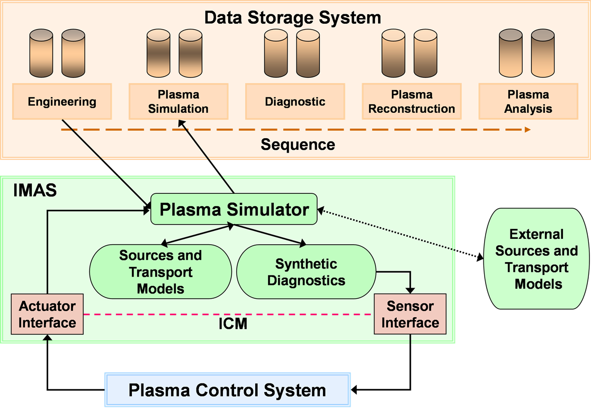
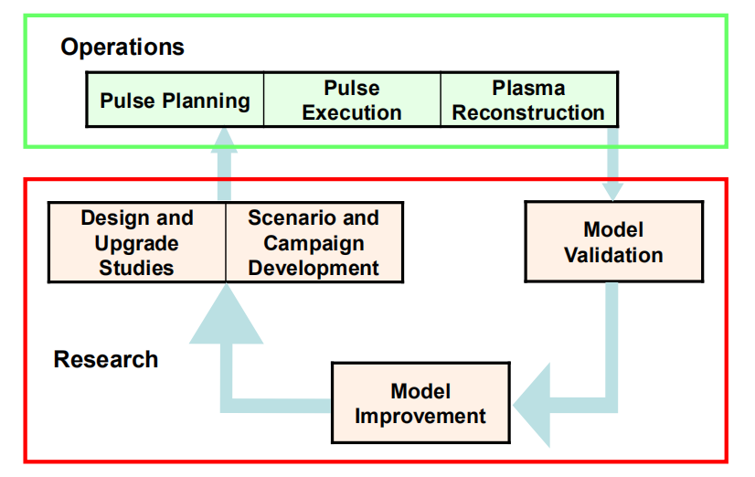

.. include:: common.rst

IMAS 开发规划（摘录）
=============================

在 ITER 制定的开发规划中（ "The ITER Integrated Modelling Programme" :cite:`pinches_iter_2014` ），对于面向 |Tokamak| 
集成建模的应用需求进行了非常完备的分析。此处摘录部分内容以作参考

等离子运行支持	
------------------------------------

等离子运行部门（以前是聚变科学和技术部门）负责开发两组物理工具来支持等离子体运行。一个是PCS3（与CODAC共同负责，并与诊断协调）。
另一个是一整套等离子体集成建模工具（IMAS），用于系统地规划和分析每次放电。尽管IM程序不负责PCS的开发，但它将在首次操作之前开发
一个等离子模拟器（PS）来测试PCS（更具体地说，PCS Simulation Platform也将模拟最终的PCS硬件）。并在操作开始后扩展和完善控制算法
（请参阅第5.1节）。由于与PCS链接的PS也可以用于放电准备（请参见第5.2节），因此其开发将成为IMAS基础结构原型的最初高优先级应用。

PS提出了更广泛的IMAS范围问题，特别是在Plant Operations Zone（POZ）方面。POZ是从一组网络和计算机中驱动托卡马克并运行实时控制系统。
它由Operations Request Gatekeeper严格保护和管理，它将筛选所有进入POZ的信息请求。该操作将筛选所有将信息输入POZ的请求。
POZ中运行的软件分为标准的3个CODAC层：安全性，保护和CODAC。在少数安全系统中运行的所有软件都必须从监管机构的角度获得许可。
但是，保护层的软件可能会以类似的严格程度进行管理。尽管存在这两个保护层以允许以较不严格和较少程序的方式进行科学和操作活动，
但CODAC软件的QA（包括PCS软件和物理模型）仍将受到严格控制，并且不被认为是其中的一部分IMAS。 IMAS程序可能会提供或查看POZ内所需的
物理代码，但CODAC对此承担所有其他责任。这种职责划分也有望应用于将原始诊断信号数据转换为物理上有意义的数量的物理代码，以便在
传输到POZ之外之前进行实时控制和显示。一旦数据不在POZ范围内，就可以使用IMAS工具进行进一步分析，包括将处理后的数据传输到控制室的实时
显示中，以供实验操作员指导。

评估 “等离子体控制系统（PCS)”
^^^^^^^^^^^^^^^^^^^^^^^^^^^^^^^^^^
5.1 用于PCS的评估等离子模拟器
IMAS工作的一个作用是协助开发和完善基于等离子体行为、执行器和传感器（诊断）的标准模型的控制算法。虽然高分辨率物理模型的细节非常详细，
但目前还不能直接应用于实时控制中，但如果物理模型对实验观测值有足够的保真度，它们可以用来测试控制算法和状态相关增益。在这方面，综合
等离子体控制能力的研究既是一种实验工具，也是一种模型。以与PCS相连的等离子模拟器为代表的综合建模将用于：

    * 制定控制策略，从引发等离子体放电到燃烧控制和终止，以及针对异常事件的替代策略
    * 通过将候选算法纳入预测仿真中，协助设计和优化反馈控制系统
    * 使用在PCS环境下运行的相关反馈模型和模拟来进行等离子体控制的测试思路

控制策略的发展包括确定各种等离子体参数对执行器的敏感性，等离子体响应时间，相关传感器的准确性和敏感性以及对正常事件的响应
（例如，从H到L的转变和破裂预测），以及异常事件（例如电源中断）。该信息为反馈模型和控制算法提供了基础。一个有效的程序需要针对
每个传感器开发综合诊断，并在PCS环境中进行操作。等离子体控制技术还需要在等离子体场景开发中自如地采用，并有助于建立控制动作的
层次结构。ITER运行期间实验的成功或失败将指导进一步的模型和算法开发，这表明与PCS链接的综合PS将继续成为ITER运行的H/He，D和D T阶段的
有效开发和计划工具。 

已到PCS，数据存储和源模块的PS的示意图如图5-1所示。尽管已将各种细节级别的等离子体模拟器（从线性算法到1.5-D传输代码）耦合到
等离子体控制系统以进行随机测试，但此处采用的概念与以往的经验有很大不同，因为在模块化的概念中PS和PCS有明显的区别：
    
    * i）所有磁约束和动力学约束决策均由PCS负责
    * ii）PCS的I / O与PCS连接到托卡马克时完全相同；
    * iii）IMAS中包含的接口模块提供PCS输出到PS输入的转换，以及PS输出到PCS输入的转换；
    * iv）一组综合诊断模块生成模拟实际诊断信号的信号（在某些情况下，甚至在大多数情况下，可以与传感器接口结合使用）。

第i）项是当前实践中最重要的偏离，目前的做法已经从早期的预编程序脉冲演变而来，几乎没有反馈控制。当前采用磁约束（例如，
耦合至自由边界平衡的传输程序）或动力学约束（例如，耦合至用于动态传感器/致动器的一个或多个模型的传输程序）的传输程序通常
包括简化的反馈模型，约束或近似表示。给定实验的PCS中的控制算法。所有控制决策和对PCS的响应都需要通过接口完全传递给PCS来确定
响应的职责。 第ii）-iv）项的设计和实施需要与PCS和诊断系统的开发紧密配合。与以往做法的重大不同认识到，预期PCS在控制ITER
等离子体以及为聚变反应堆的控制奠定基础方面将发挥更加关键的作用。

 

    
    图5.1 用作托卡马克代理的等离子模拟器需要接口控制模块（ICM），将来自PCS的致动器信号转换为源的建模输入参数，并将合成诊断信号
转换为返回到PCS的一组传感器响应.

在PCS开发中托卡马克的替代品的背景下，PS可以采用等离子体响应的简化模型（例如线性或非线性代数），从而可以进行实时仿真，
但随着PCS设计的成熟，也可以采用更全面的经过验证的模型。 PS和PCS之间的接口预计将体现在接口控制模块（ICM）中，
该模块在图5-1中以两个单独的元素表示，包括执行器和传感器。 ICM从PS接收有关当前等离子体状态的信息（例如，合成诊断，
目标等离子体状况以及用于积分或微分控制的存储器持久性数据），将这些信息馈送到PCS以修改执行器特性和适用的时间间隔，
然后由PCS 将这些通过ICM传回PS。 ICM的设计将是IM程序和PCS设计团队的共同努力。

5.2放电规划
^^^^^^^^^^^^^^^^^^^^^^^^^^^^^^^^^^^^^^^^^^^^^^^^^^^^^^

除了开发用于开发和评估PCS算法的等离子模拟器之外，还有一些运维模型应用程序将应用于每个ITER放电。 与建模相关的活动顺序
在表5-1中列出，其中将其分为“放电计划”，“放电执行”和“等离子体重建”阶段。 基础设施和基本功能将在建设阶段进行开发和测试，
并将在首次实验活动之前提供，而物理内容将在整个ITER实验计划中发展。

.. table:: IM 工具在支持等离子操作中的应用

    +---------------------------------+-------------------------+------------------------+
    | Pulse Planning                  |Pulse Execution          |Plasma Reconstruction   |
    +=================================+=========================+========================+
    | Segment Simulation              | Real-Time Reconstruction|Automated Reconstruction|
    +---------------------------------+                         +                        +
    | Pulse Assembly                  |                         |                        |  
    +---------------------------------+-------------------------+------------------------+
    | Physics Validation              | Live Reconstruction     |Interpretive Analyses   |
    +---------------------------------+                         +                        +
    | Pre-Campaign System Validation  |                         |                        |
    +---------------------------------+-------------------------+------------------------+
    | Campaign Organization           | Forecasting             | Data Mining            |
    +---------------------------------+                         +                        +
    | Daily System                    |                         |                        |                 
    +---------------------------------+-------------------------+------------------------+
          

放电规划是等离子体情景建模工作的自然延伸，主要由ITPA在ITER建设阶段进行。预计将通过模型来支持活动的实验性建议，以证明预期
结果在ITER的运营能力和经验范围内是可信的。随着ITER的进展，等离子研究活动将加强规划：  
    
    * i）由于理论，数值或验证程序的进展而改进了模型，
    * ii）调整了可调整的模型参数，
    * iii）使用了以前类似方法的实验结果代替模型预测（例如，采用标准启动顺序）放电。

放电规划包括从启动到终止的预期等离子体行为额评估，它受系统要求和限制的约束，并且可以识别故障改善技术。但这并不意味着每次
放电从启动到终止都需要完整的仿真。具有1.5-D传输代码的等离子体模拟通常在闭合通量表面破裂并形成后开始，初始条件取自标准
等离子体引发程序。在当前的平顶期间，预期放电过程将由多个阶段组成，其中每个阶段之间会改变一个或多个条件。如果一系列放电
包括相同的启动和斜坡上升，则初始段的初始条件可以取自已知性能和系统要求的先前放电，也可以是模拟的以前的放电。类似地，一次
放电可能会使用一个与前一次放电相同的几个阶段，因为预先编程的时间序列被研究作为接近最佳条件的基础，或者用一个辅助加热系统
替代了另一个辅助加热系统。简而言之，建议的放电可以由先前的操作经验中已知的部分组成，并辅助建模。

表 `IM 工具在支持等离子操作中的应用`_ 中的放电规划展示了计划和验证过程中的六个步骤，其中四个步骤使用IMAS或系统工具，另外
两个涉及物理团队和实验操作员的判断。
模拟阶段和放电阶段被显示为两个单独的步骤，尽管它们并不完全独立。分段的概念源自ITER的长放电功能，可以预见每个分段可以评估
不同组的等离子体和运行条件。但是，由于环形电流曲线的缓慢发展以及对q剖面的局限性，ITER等离子体有望保留大量记忆。因此，后续段
的选择通常将取决于先前的段，即，每个段中的放电不能总是被视为独立于放电历史的状态。在任何情况下，脉冲都应包括操作员实施的选项，
因此需要和其他部门进行讨论。

第三步是物理验证，由物理团队进行判断。此评估有几个方面。首先，由于模型的不确定性，模拟中预期的不确定性是什么？这可以通过
以下方式部分解决：要求使用相同的一组模型模拟类似的先前放电（验证），然后将预期性能的变化量化为密度，加热或其他参数的变化。
第二，PCS可以管理等离子体吗？如果仿真与PCS以耦合方式运行（如图5-1所示），则可以定量回答该问题，这使仿真免于对ITER控制能力
进行独立（可能只是部分评估）评估。该步骤的输出是一组数据，该数据不仅包括作为功能时间的预期等离子体参数，还包括对系统每个
组件的预期需求。其中一些可以很容易地确定，但是下面的列表并不详尽。对于PF系统，此数据包括每个线圈上的电流，力和电压。对于
加热系统（2个NBI，2个RF天线，24个ECH系统），它包括随时间变化的功率和配置。对于加料系统，它包括燃料混合物，预期的喷射速率
以及每个气阀和颗粒喷射器的时间供应。对于偏滤器，它包括与时间有关的，综合的热负荷和泵送。必须确定控制和评估物理所需的诊断
系统。对于这些外部系统，当前的预测建模工作通常不会涉及到如此具体的细节，但是对于ITER，系统验证将需要此信息。
预前系统验证包括检查对系统预期可用性的放电要求，以及这些要求是否在预期的机器功能范围内。 预期将使用CODAC提供的工具执行此
检查，并对照模拟/组合放电提供的数据集运行该检查。 可以将此工具链接到仿真，以便评估可以与仿真同时进行，但是也可以在物理验证
步骤之前由用户单独执行，以识别放电可能无法满足的任何系统限制 。

活动组织包括选择一组经过验证的候选放电，并将它们组织为物理运动的逻辑顺序。 然后将经过验证的候选放电集安排到日常活动中。 
考虑特定的关键系统故障等因素，在建议的上限扫描次数允许的范围内，应该执行比日常安排中更多的放电次数。此过程类似于具有以下
操作的储备的当前做法： 探索性脉冲通常在一天结束时执行（搭载实验）。

在每天的活动开始时，操作员将使用“活动前验证”步骤中使用的相同工具执行“每日系统验证”，包括对系统的任何其他临时限制。

放电执行
^^^^^^^^^^^^^^

实时重建对于成功执行ITER放电必不可少。 实时分析的数据是PCS在控制等离子体（例如磁面重构）中的运行所必需的，并且它同时展示
放电期间等离子体条件和行为的演变过程以随时指导实验员的操作。 在最基本的级别上，实时重建基于使用校准参数对诊断信号的缩放。
在更高级的水平上，它包含了更复杂的物理分析，例如 实时MHD平衡或完整的等离子体剖面。

实时和在线的重建分析的结果将与在规划阶段生成的预期放电性能结果一起展示在控制室中，即将同时显示各种参数的实验轨迹和预期轨迹。
这将提供对放电规划的保真度的评估，对意外行为的提供指示，并指导实验操作员做出决定是继续通过后续片段继续放电还是在为该会话安排
的扫描中继续后续放电。在表5-1中，即使可能存在很多重叠，实时重建和在线重建也被标识为单独的项目。两者之间的区别在于延迟：与等
离子控制的实时要求相比，控件中的实时显示可承受更多的延迟（〜秒），因此可能更全面。
在准稳定条件下（例如，段中的后期）进行时间片分析可以为实验操作员提供进一步的指导；可以为预先选择的时间片启动一些工具，这些
工具只需要比实时分析所允许的更多的计算时间。一个例子就是对输运性质的评估，其中包括对源剖面的计算（通常称为解释性分析）。
因为计算能力的提高，加上放电时间长，使得ITER能够使用“预测”工具来指导每一炮开展过程中的操作。这里的“预测”定义为在当前
等离子状态给定的初始条件下启动预测模拟（或多次模拟），以及相关的实验措施（例如，加热或燃料源的增加）。例如，这些“预测”
可以建议实验操作员判断其动作是否超出操作控制范围。利用“干预”措施，可以取消辅助功率的进一步增加，因为已看到等离子体已经
偏离计划的轨迹（例如，由于计划外的临时减少加热或燃料源而漂移）。“预测”可以为操作员提供短期（10秒）和长期指导（〜100 s），
但是在这两种情况下，都要比实时仿真发挥作用快得多。在深入执行ITER运行计划之前，即直到已针对ITER的实际运行对模型进行了充分
合理的验证之前，预计预测是不可行或不可靠的。预测能力也将是朝着在ITER运行的后期阶段，或在DEMO或商业聚变发电设施运行之前对
操作员进行培训的系统模拟器的开发迈出的一步。实际上，在以实时预测模式实施之前，预期上述预测工具将在脱机放电前和放电后分析
期间通过验证测试进行。

等离子体重建
^^^^^^^^^^^^^^

对实验结果进行有效解释性分析的主要要求之一是建立一个自动系统，用于将诊断信号处理为一组物理上一致的参数和配置文件。自动化
重建的第一阶段将在POZ内进行，包括从每个诊断程序以标准单位生成物理上有意义的等离子体参数。诊断开发人员，诊断部门和CODAC共同
负责开发，测试和维护相关的物理模型和代码，而IAS应该仅充当评审角色，以确保模型与放炮之前的规划模型及放炮之后的分析模型保持
一致。确保这种一致性的一种方法是在IMAS基础架构中开发这些模型。尽管每个诊断程序要测量的等离子体参数在PAs(ProcurEment 
Arrangements)中指定，但直到设计完成（针对初步特征）和对系统进行测试（针对最终特征）之前，它们的实际时空分辨率才知道。
中等水平的重建是从多个诊断程序收集数据，以在测量误差允许范围内对整个等离子体产生过程进行一个自洽的描述。这通常是一个迭代
过程，并且需要IM程序开发一套工具。磁平衡的迭代过程，大家都很熟悉：等离子体剖面的重建需要了解磁性几何形状，而MHD平衡重建则
需要了解等离子体压力和电流剖面。用于解释性建模的物理和其他数值工具包组件也将在此解释性分析中使用。第二级处理将在POZ外部进行，
并且需要IM程序（提供物理代码），诊断程序（数据生成和验证）和CODAC（从POZ传输数据，自动启动分析代码以及存储已经处理的数据）
之间密切协作。

较高级别的重建（例如，从临时的等离子体行为中推断出输运特点）通常需要用于粒子，能量，扭矩和电流驱动源的模型。这些通常不能直接测量，
即它们需要重用预测建模中使用的某些相同组件。在某些情况下，较高水平的重建可能是自动化的，但是在ITER开始运行后，可能需要进入开发阶段，
并且将工具应用于选定的判断以评估方法。
数据挖掘代表了另一种类型的放电后分析，该分析可能是自动化的也可能不是自动化的，并且可以归类为等离子实验或等离子研究。 数据挖掘使用
可识别特定等离子体条件，特性或行为的工具，这些条件可用于进一步分析。 这对于识别等离子体参数或特性之间的相关性，构建等离子体行为的
参数表示等也可能很有用。自动数据处理之后是对特定的放电炮，片段或时间片的更详细的物理分析。 这涉及到控制算法的重新调整和操作约束的表示，
模型验证和模型改进。 这些被归类为“等离子体研究”支持，将在下面进行讨论，并以闭环的形式以增强对未来操作的准备。

等离子研究支持
--------------------
在ITER建设阶段，IMAS程序有望为ITER设施的设计基础提供支持，用来评估候选等离子体运行方案，协助制定等离子体控制策略以及为运行期间的
实验结果分析做准备。预计支持物理研究与开发计划将通过对国内设施处理 ITER Research Plan （IRP）和附录A中确定的物理问题的结果的验证工作，
在开发更全面的模型方面不断取得进展。IO将通过ITPA开展这些工作，以期发展集成的建模功能，以更有效地指导ITER的运行和研究。到建造工作快要
结束时，即在预期的首次进行H / He等离子运动之前的几年，IMAS程序应该能够证明IMAS与国内程序中的建模工作之间的有效耦合，这将支持全部运营
和研究应用范围。
随着ITER逐步完成H / He，D和DT阶段，物理能力将进一步成熟。 这种成熟是ITER研究计划的目标。 IRP的所有方面都将由ITER合作当的参与来推动，
而IO将提供合作和支持。 图6-1描绘了等离子操作和等离子研究的建模支持之间的联系。 在ITER运行之前，改进将完全基于通过ITPA协调的家庭设施
的运行。 但是，在ITER运行期间，还将通过补充研究继续为国内设施在模型改进方面做出贡献。随着ITER逐步完成H / He，D和DT阶段，物理能力将
进一步成熟。 这种成熟是ITER研究计划的目标。 IRP的所有方面都将由ITER缔约方的参与来推动，而IO将提供合作和支持。 图6-1描绘了等离子操作
和等离子研究的建模支持之间的联系。 在ITER运行之前，这些改进将完全基于国内设施的运行，并通过ITPA进行协调。 但是，在ITER运行期间，还将
通过补充研究继续为国内设施在模型改进方面做出贡献。

    图6-1：物理研究计划通过验证和改进模型，为更有效的计划和操作提供了基础。

设计和升级研究
^^^^^^^^^^^^^^^^^^^^
影响ITER设计决策的能力在施工期间迅速减弱。然而，需要进行设计和升级研究，以便在长期内做出更适度的改进。
IRP（ITER Research Plan）中描述了升级选项。

方案和活动开发
^^^^^^^^^^^^^^^^^^^^

方案和活动开发包括广泛的活动，调查对操作边界、源和等离子体行为之间的非线性相互作用等的敏感性。此处使用术语“方案”来描述从开始到结束的整个
放电过程，即，除了时间积分限制（例如极向通量消耗），还考虑了进入和退出平顶操作。ITER初始设计参考案例的建模仅限于平顶期间全性能、H模式DT运行。
尽管这些被称为参考“方案”，但它们仅提供了ITER运行的有限视图。有必要对这些参考案例进行更全面的评估，以确定在辅助系统的操作限制范围内进出平顶
条件的方法。此外，必须制定调试和测试ITER系统能力的低激活阶段（H/He等离子体）的方案。这将包括在探索进入H模式时的重要L模式操作，以及为DD和DT
操作做准备的ELM改进。在较长的时间尺度上，由于获得ITER混合（长脉冲）和稳态任务所需的高限制的挑战，应研究更广泛的情景。

ITER需要一系列的建模工具来开发自洽的场景，最详细的分析预计将对物理和计算提出大量要求。设想场景开发从范围界定到活动开发：

    * 范围界定：使用操作边界的近似表示、源程序的预编程或理想控制，对一系列参数的H&CD、燃料、泵送、功率处理进行评估的简化模型
    * 活动开发：更详细的分析，包括稳定性和控制要求、诊断、基于子系统可用性的替代方案、系统限制和故障改善技术、操作对模型不确定性的敏感性

更广泛的场景和活动应包括，例如：
  
    * 支持ITER研究计划的调试和科学探索计划
    * 加热、加油和电流驱动策略，以达到所需的运行状态
    * 在稳定、限制、PF系统、壁面相互作用、致动器限制、诊断限制和其他系统约束的操作边界内进行性能优化
    * 专注于所需物理的实验，尽量减少其他现象的干扰
    * 检查特定物理问题的诊断要求
    * 尽可能确定现有设施上的实验，以验证模型的基本特征

模型验证
^^^^^^^^^^^^
模型验证是改善控制ITER操作条件和优化等离子体性能前景的关键因素。为演示程序的设计提供了更为坚实的基础。如前所述，
在ITER开始运行之前，可用于模型验证的唯一数据是由国内方案中目前正在运行的设施提供的。这清楚地表明，模型验证的近期
责任在于国内方案，这一点得到了ITPA的充分承认。即使在ITER运行期间，预计国内设施将提供额外的支持数据，以在更广泛的
范围内验证模型，此外，通过新诊断方法支持的良好控制的实验条件隔离物理问题的可能性更大。因此，即使从长期来看，
在最广泛的等离子条件下进行模型验证的主要责任将落在国内项目上。

模型改进
^^^^^^^^^^^^

当然，在根据新的诊断测量或在新的操作条件下进行测试后，模型可能会被确定为无效。验证过程通常会发现模型改进的线索，
这些线索可以采取多种形式：从由于模型中的近似而导致的重整化（尽管如此，仍保持了标度），以及添加在原始模型中被认为
可以忽略不计的物理元素，为了废除模型而赞成对观测值进行经验近似（希望只是暂时的解决方案，但经常使用）。与模型验证
工作一样，模型改进的责任主要在于国内方案。增强的物理保真度只是预期模型改进工作的一部分。正如在操作建模支持的讨论
中所指出的，系统脉冲设计、执行和重建应用面临时钟时间的严格限制——平均而言，每天运行的所有数据必须在一天内处理。
通常假设计算架构的改进将满足这些时钟时间限制。但未来十年的进一步改进只会来自于更多的并行化，许多现有的代码将不得
不重组以利用这些变化。时钟时间限制也可以通过使用捕捉微观模型的宏观特征的简化模型，以及通过新的计算方法和算法来满足。
