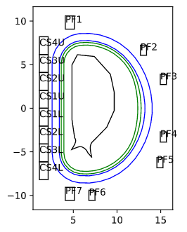
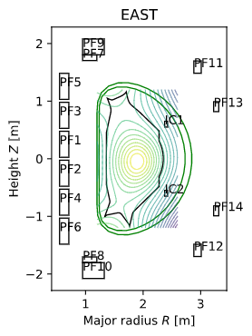

数据统一访问
==============================

概述  
-------------
   
   数据接口实现对于多个数据源的统一访问。

   * 通过URI制定装置数据库，
   * 读取装置数据
   * 完成对树状文档节点的访问
   * 画出装置结构，存在平衡数据的话，画出平衡磁面

实例  
-------------

>>> def plot_machine(device_name, entry):
        #
        # 完成对树状文档节点的访问
        #
        vessel_inner_points= np.array([ entry.wall.description_2d.vessel.annular.outline_inner.r(),
                                        entry.wall.description_2d.vessel.annular.outline_inner.z()]).transpose([1,0]) 
        vessel_outer_points= np.array([entry.wall.description_2d.vessel.annular.outline_outer.r(),
                                        entry.wall.description_2d.vessel.annular.outline_outer.z()]).transpose([1,0])  
        tf_inner_points= np.array([entry.tf.coil.outline_inner.r(),entry.tf.coil.outline_inner.z()]).transpose([1,0]) 
        tf_outer_points= np.array([entry.tf.coil.outline_outer.r(),    
                                                entry.tf.coil.outline_outer.z()]).transpose([1,0])  
        limiter_points =  np.array([entry.wall.description_2d[0].limiter.unit[0].outline.r(),
                                        entry.wall.description_2d[0].limiter.unit[0].outline.z()]).transpose([1,0]) 
        #
        # 绘制装置图
        #
        fg=plt.figure()
        plt.gca().add_patch(plt.Polygon(limiter_points , fill=False,closed=True))
        plt.gca().add_patch(plt.Polygon(tf_inner_points , fill=False,closed=True,color="blue"))
        plt.gca().add_patch(plt.Polygon(tf_outer_points , fill=False,closed=True,color="blue"))
        plt.gca().add_patch(plt.Polygon(vessel_outer_points , fill=False,closed=True,color="green"))
        plt.gca().add_patch(plt.Polygon(vessel_inner_points , fill=False,closed=True,color="green"))
        #
        # 遍历
        #
        for coil  in entry.pf_active.coil:
            rect=coil.element[0].geometry.rectangle.__value__() 
            plt.text(rect.r-rect.width/2.0, float(rect.z),str(coil.name))
            plt.gca().add_patch(plt.Rectangle((rect.r-rect.width/2.0, rect.z-rect.height/2.0), rect.width, rect.height, fill=False))
        #
        # 获取二维数据
        #
        psirz=entry.equilibrium.time_slice.profiles_2d.psi()
        if len(psirz)>0:
            r, z = np.meshgrid(  entry.equilibrium.time_slice.profiles_2d.grid.dim1(),
                                entry.equilibrium.time_slice.profiles_2d.grid.dim2(), indexing='ij')
            plt.contour(r,z, psirz, levels= 30,linewidths=0.5)
        #
        # 完成绘图
        #
        plt.gca().set_xlabel(r"Major radius $R$ [m]")
        plt.gca().set_ylabel(r"Height $Z$ [m]")
        plt.gca().set_title(device.upper())
        plt.axis('scaled')
        plt.show()
>>>
>>> # 设定 CFETR 数据库 
>>>
>>> entry =open_entry(f"cfetr+mdsplus:///<MDSplus数据存储路径>/~t/?tree_name=cfetr", shot=0, time_slice=20)
>>> plot_machine(device,entry)
 

>>>
>>> # 设定 EAST 数据库 
>>>
>>> entry =open_entry(f"east+mdsplus:///<MDSplus数据存储路径>/~t/?tree_name=east_fit", shot=55555, time_slice=20)
>>> plot_machine(device,entry)

