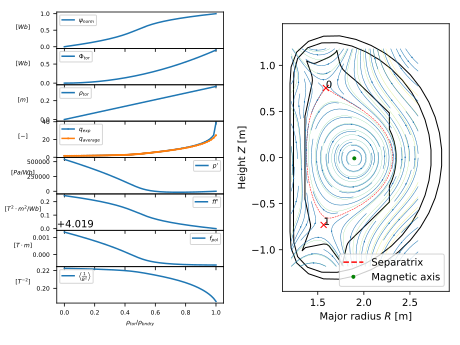

平衡分析
==============================

概述
-------------
   
    * 从EAST实验数据库读取原始实验数据 shot=55555， time slice=100
    * 读取线圈位置信息，
    * 设定X 点，isoflux等信息；
    * 进行磁面平均计算磁面平均量, 给出相关量随 :math:`\rho=\sqrt{\Phi_{tor}/\pi B_0}` 分布

    .. note:: 磁场重构过程中，由于未指定pprime和ffprime， 模拟器 会读取数据空Ip等信息用来估测等profile。

实例  
-------------

>>> from spdm.util.logger import logger  
>>> from spdm.data.Entry import open_entry  # UDA 访问入口
>>> from fytok.Tokamak import Tokamak       # Tokamak module
>>> import matplotlib.pyplot as plt
>>> 
>>> # 从efit_east tree 读取读取 shot=55555， time slice=100
>>> 
>>> tok = Tokamak(open_entry("east+mdsplus://<MDSplus数据存储路径>/public_data/~t/?tree_name=efit_east", \
    shot=55555, time_slice=100))
>>> xpoints = [[p.r, p.z] for p in tok.equilibrium.boundary.x_point] # 从原始平衡中读取X点位置
>>> lfcs_r = tok.equilibrium.boundary.outline.r  # 获取最外层闭合磁面
>>> lfcs_z = tok.equilibrium.boundary.outline.z
>>> ir_min = np.argmin(lfcs_r)
>>> ir_max = np.argmax(lfcs_r)
>>> iz_min = np.argmin(lfcs_z)
>>> iz_max = np.argmax(lfcs_z)
>>> 
>>> # 设定 isoflux
>>> 
>>> isoflux = [(lfcs_r[ir_min], lfcs_z[ir_min], lfcs_r[ir_max], lfcs_z[ir_max]),
               (lfcs_r[iz_min], lfcs_z[iz_min], lfcs_r[iz_max], lfcs_z[iz_max])]  # (R1,Z1, R2,Z2) pair of locations
>>> 
>>> tok.equilibrium.update(    # 重构磁场
>>>      constraints={
>>>          "xpoints": xpoints,
>>>          "isoflux": isoflux
>>>      })
>>> 
>>> tok.equilibrium.plot_full().show() # 显示结果

